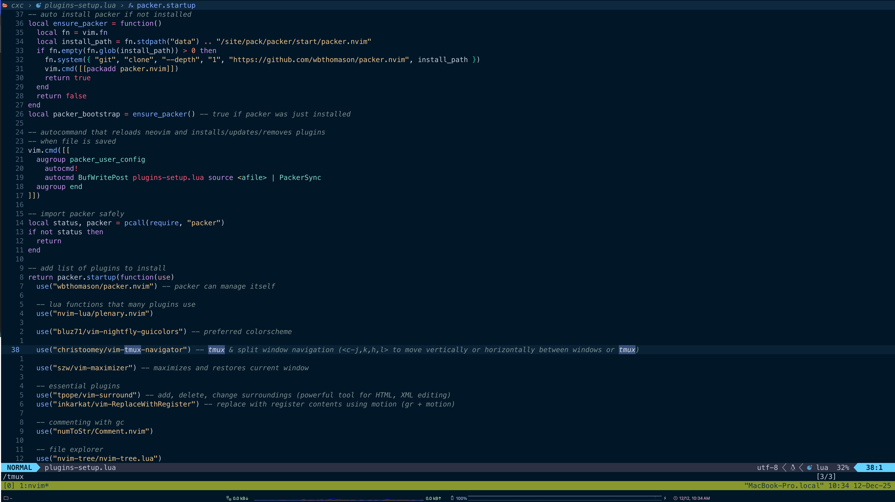

If you are like me, you’ve probably looked at your terminal setup and wondered: "Why do I have three different ways to split my screen?"

iTerm2 can split panes. Tmux can split panes. Neovim can split panes.
<!--truncate-->


For a long time, I just used iTerm2 splits because they were easy. But recently, I dusted off my old Tmux configuration to build a more robust development environment. The problem? My muscle memory was suffering. I’d use Ctrl+w to move around in Vim, but then have to reach for a clumsy Tmux prefix just to check a server log in the pane next door.

Today, I finally fixed it. I unified the navigation so that Neovim and Tmux act as one single organism.

The Philosophy: The "Russian Nesting Doll"
First, I had to sort out the mental model. Here is the rule of thumb I settled on:

Neovim Splits: Use these for code context. If I'm comparing files or referencing a definition, it stays in Neovim.

Tmux Splits: Use these for processes. Running npm run dev, checking database logs, or git commands. These live outside the editor but inside the session.

iTerm2: Just the container. No splits here.

The Secret Sauce: vim-tmux-navigator
The goal is simple: I want to use Ctrl + h/j/k/l to move my cursor. If I'm in a Vim split and I move right, it should go to the next Vim split. If I'm at the edge of Vim and move right again, it should jump seamlessly into the Tmux pane.

Here is how I set it up.

# 1. The Tmux Config (~/.tmux.conf)
I overhauled my old config to be more modern. I switched the prefix to Ctrl+a (easier on the pinky) and added the magic "is_vim" check.

```Bash
# ~/.tmux.conf

# 1. Enable Mouse & True Color
set -g mouse on
set-option -sa terminal-overrides ",xterm*:Tc"

# 2. Remap Prefix to Ctrl-a
unbind C-b
set -g prefix C-a
bind C-a send-prefix

# 3. Intuitive Splits (| for vertical, - for horizontal)
bind | split-window -h -c "#{pane_current_path}"
bind - split-window -v -c "#{pane_current_path}"

# 4. The Magic: Smart pane switching with awareness of Vim splits
is_vim="ps -o state= -o comm= -t '#{pane_tty}' \
    | grep -iqE '^[^TXZ ]+ +(\\S+\\/)?g?(view|n?vim?x?)(diff)?$'"

bind-key -n 'C-h' if-shell "$is_vim" 'send-keys C-h'  'select-pane -L'
bind-key -n 'C-j' if-shell "$is_vim" 'send-keys C-j'  'select-pane -D'
bind-key -n 'C-k' if-shell "$is_vim" 'send-keys C-k'  'select-pane -U'
bind-key -n 'C-l' if-shell "$is_vim" 'send-keys C-l'  'select-pane -R'
```
# 2. The Neovim Config
Since I'm using Packer, adding the plugin was trivial. I just added this line to my plugins-setup.lua and let the auto-command handle the installation:

```Lua
-- plugins-setup.lua
use("christoomey/vim-tmux-navigator")
```
# The Result
After sourcing the configs and running `PackerSync` the friction is completely gone.

I can have Neovim on the left and my server logs on the right. I press `Ctrl+l`, and my cursor flies from the code to the logs. I press `Ctrl+h`, and I'm back editing. No prefix keys, no context switching—just flow.

If you are still manually clicking between terminal windows, do yourself a favor and set this up. It’s a game changer.
